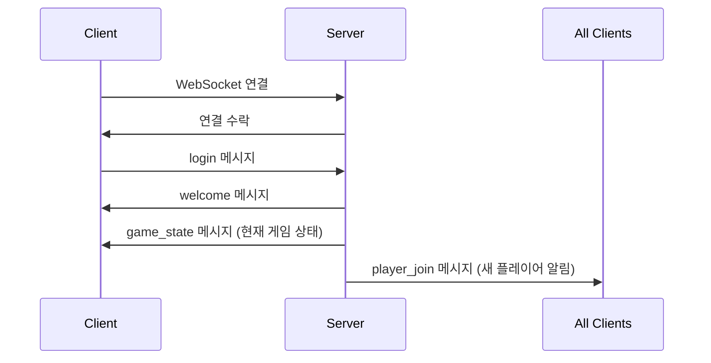
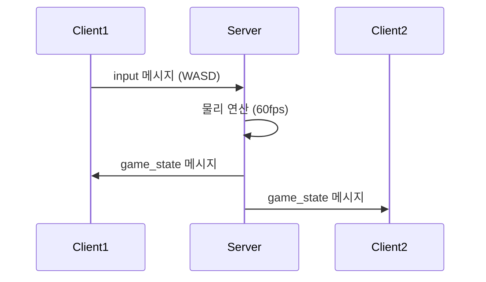
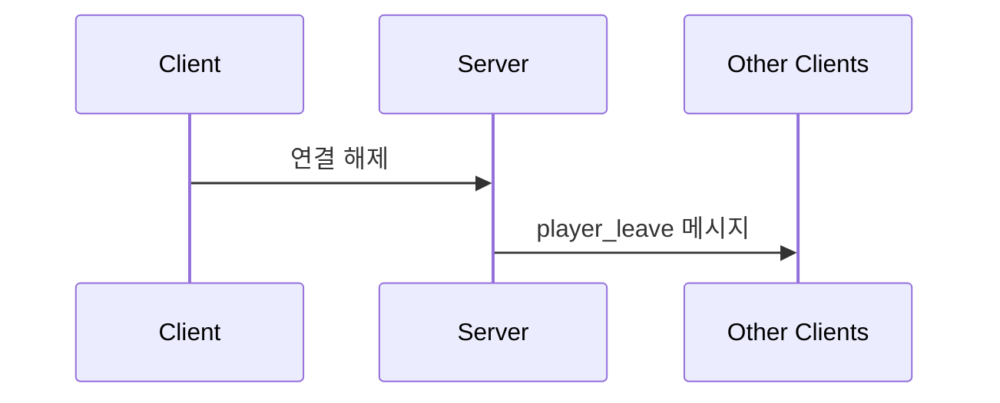

# 🔌 WebSocket API 명세서

## 📋 개요

이 문서는 멀티플레이어 게임의 WebSocket API 명세를 정의합니다. 모든 통신은 JSON 형식의 메시지로 이루어집니다.

## 🌐 연결 정보

- **URL**: `ws://localhost:3000/ws` (개발 환경)
- **프로토콜**: WebSocket
- **데이터 형식**: JSON
- **인코딩**: UTF-8

## 📨 메시지 구조

모든 메시지는 다음과 같은 기본 구조를 따릅니다:

```json
{
  "type": "메시지_타입",
  "payload": {
    // 메시지별 데이터
  }
}
```

## 🔄 메시지 타입

### 클라이언트 → 서버

#### 1. 로그인 (login)

플레이어가 게임에 로그인할 때 전송됩니다.

```json
{
  "type": "login",
  "payload": {
    "name": "플레이어이름",
    "color": "#FF6B6B",
    "lastPosition": {
      "x": 400.0,
      "y": 300.0
    }
  }
}
```

**필드 설명:**

- `name` (string, 필수): 플레이어 이름 (2자 이상)
- `color` (string, 선택): 플레이어 색상 (HEX 형식)
- `lastPosition` (object, 선택): 이전 접속 시 마지막 위치

**응답:** `welcome` 메시지

#### 2. 입력 (input)

플레이어의 키보드 입력을 전송합니다.

```json
{
  "type": "input",
  "payload": {
    "key": "w",
    "pressed": true
  }
}
```

**필드 설명:**

- `key` (string, 필수): 눌린 키 ("w", "a", "s", "d")
- `pressed` (boolean, 필수): 키가 눌렸는지 여부 (현재는 항상 true)

**응답:** 없음 (서버에서 물리 연산 후 `game_state` 브로드캐스트)

### 서버 → 클라이언트

#### 1. 환영 (welcome)

플레이어 로그인 성공 시 전송됩니다.

```json
{
  "type": "welcome",
  "payload": {
    "id": "abc123def",
    "playerNum": 1,
    "name": "플레이어이름",
    "color": "#FF6B6B"
  }
}
```

**필드 설명:**

- `id` (string): 고유 플레이어 ID
- `playerNum` (int): 접속 순서 (1부터 시작)
- `name` (string): 플레이어 이름
- `color` (string): 할당된 색상

#### 2. 게임 상태 (game_state)

모든 플레이어의 현재 상태를 브로드캐스트합니다.

```json
{
  "type": "game_state",
  "payload": {
    "abc123def": {
      "id": "abc123def",
      "playerNum": 1,
      "name": "플레이어1",
      "x": 400.0,
      "y": 300.0,
      "vx": 0.0,
      "vy": 0.0,
      "color": "#FF6B6B",
      "joinedAt": "2025-07-26T23:30:00Z",
      "lastSeen": "2025-07-26T23:30:05Z"
    },
    "def456ghi": {
      "id": "def456ghi",
      "playerNum": 2,
      "name": "플레이어2",
      "x": 500.0,
      "y": 400.0,
      "vx": 2.5,
      "vy": -1.0,
      "color": "#4ECDC4",
      "joinedAt": "2025-07-26T23:30:10Z",
      "lastSeen": "2025-07-26T23:30:15Z"
    }
  }
}
```

**필드 설명:**

- `payload` (object): 플레이어 ID를 키로 하는 플레이어 정보 맵
- 각 플레이어 객체는 `Player` 구조체와 동일한 필드 포함

#### 3. 플레이어 입장 (player_join)

새로운 플레이어가 게임에 참여할 때 브로드캐스트됩니다.

```json
{
  "type": "player_join",
  "payload": {
    "id": "abc123def",
    "playerNum": 1,
    "name": "새플레이어",
    "x": 400.0,
    "y": 300.0,
    "color": "#FF6B6B"
  }
}
```

#### 4. 플레이어 퇴장 (player_leave)

플레이어가 게임을 떠날 때 브로드캐스트됩니다.

```json
{
  "type": "player_leave",
  "payload": {
    "id": "abc123def"
  }
}
```

#### 5. 플레이어 이동 (player_move)

개별 플레이어의 위치 변경 시 브로드캐스트됩니다.

```json
{
  "type": "player_move",
  "payload": {
    "id": "abc123def",
    "x": 450.0,
    "y": 350.0
  }
}
```

## 🎮 게임 상태 데이터 구조

### Player 객체

```typescript
interface Player {
  id: string; // 고유 식별자
  playerNum: number; // 접속 순서 (1부터 시작)
  name: string; // 플레이어 이름
  x: number; // X 좌표 (0-800)
  y: number; // Y 좌표 (0-600)
  vx: number; // X 속도
  vy: number; // Y 속도
  color: string; // 색상 (HEX 형식)
  joinedAt: string; // 접속 시간 (ISO 8601)
  lastSeen: string; // 마지막 활동 시간 (ISO 8601)
}
```

### 게임 상수

```typescript
const GAME_CONSTANTS = {
  CANVAS_WIDTH: 800,
  CANVAS_HEIGHT: 600,
  PLAYER_RADIUS: 15,
  MIN_DISTANCE: 30, // 플레이어 간 최소 거리
  MOVE_SPEED: 2.5, // 이동 속도
  FRICTION: 0.98, // 마찰 계수
  BOUNCE_FACTOR: 0.7, // 벽 충돌 시 반동 계수
  TICK_RATE: 60, // 물리 연산 주기 (fps)
};
```

## 🔄 통신 플로우

### 1. 연결 및 로그인



### 2. 게임 플레이



### 3. 플레이어 퇴장



## ⚠️ 에러 처리

### 1. 연결 에러

```json
{
  "type": "error",
  "payload": {
    "code": "CONNECTION_FAILED",
    "message": "연결에 실패했습니다."
  }
}
```

### 2. 메시지 파싱 에러

잘못된 형식의 메시지가 전송되면 서버에서 무시하고 로그에 기록합니다.

### 3. 재연결 처리

클라이언트는 연결이 끊어지면 3초 후 자동으로 재연결을 시도합니다.

```javascript
socket.onclose = () => {
  setTimeout(() => {
    if (!isConnected) {
      connect();
    }
  }, 3000);
};
```

## 🔧 성능 최적화

### 1. 브로드캐스팅 최적화

- 변경사항이 있을 때만 `game_state` 전송
- 불필요한 메시지 전송 방지
- JSON 직렬화 최적화

### 2. 메시지 압축

현재는 압축을 사용하지 않지만, 필요시 다음과 같이 구현 가능:

```go
// 서버 측 압축
import "github.com/valyala/gozstd"

compressed := gozstd.Compress(nil, jsonData)
```

### 3. 배치 처리

여러 메시지를 하나로 묶어서 전송:

```json
{
  "type": "batch",
  "payload": {
    "messages": [
      {"type": "player_move", "payload": {...}},
      {"type": "player_move", "payload": {...}}
    ]
  }
}
```

## 🧪 테스트

### 1. WebSocket 연결 테스트

```bash
# wscat을 사용한 테스트
npm install -g wscat
wscat -c ws://localhost:3000/ws
```

### 2. 메시지 전송 테스트

```bash
# 로그인 메시지
{"type":"login","payload":{"name":"test","color":"#FF0000"}}

# 입력 메시지
{"type":"input","payload":{"key":"w","pressed":true}}
```

### 3. 부하 테스트

```javascript
// 여러 클라이언트 시뮬레이션
for (let i = 0; i < 10; i++) {
  const ws = new WebSocket("ws://localhost:3000/ws");
  // 메시지 전송 및 수신 테스트
}
```

## 📝 버전 관리

### 현재 버전: v1.0.0

- 기본 멀티플레이어 기능
- 서버 authoritative physics
- 실시간 동기화

### 향후 계획

- v1.1.0: 채팅 시스템 추가
- v1.2.0: 게임 룸 시스템
- v2.0.0: 데이터베이스 연동

---

이 API 명세서를 통해 클라이언트와 서버 간의 통신 방식을 완전히 이해할 수 있습니다.
